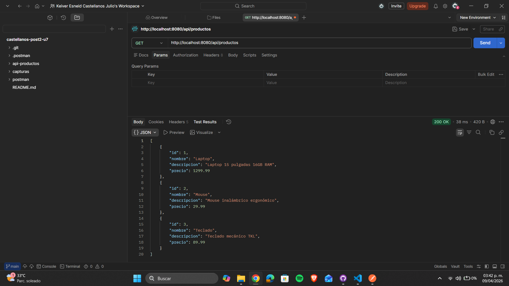
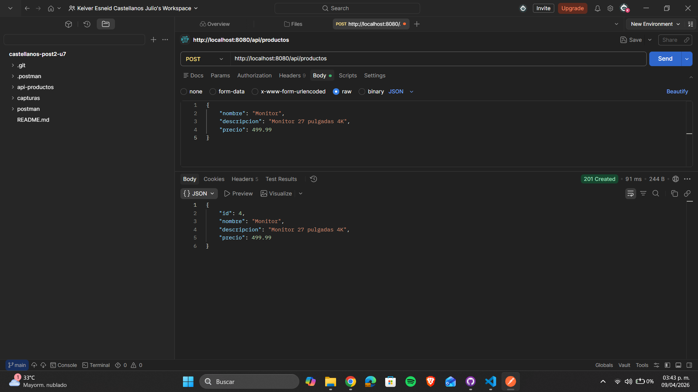
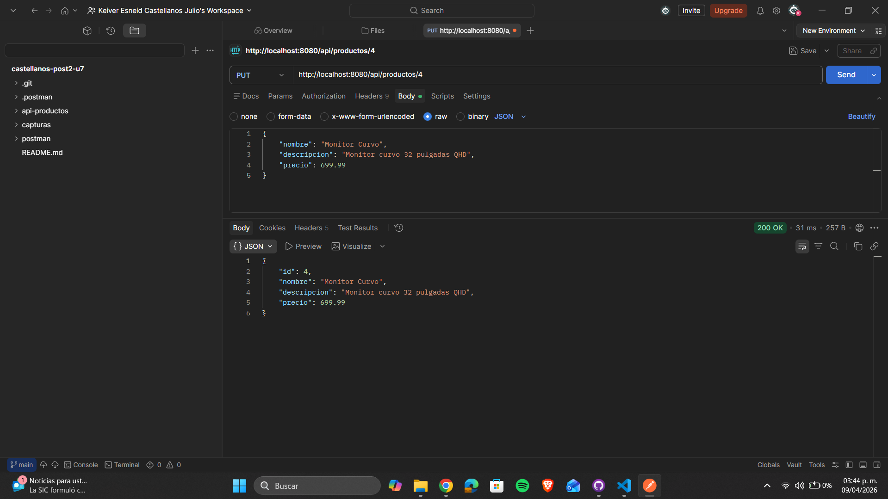
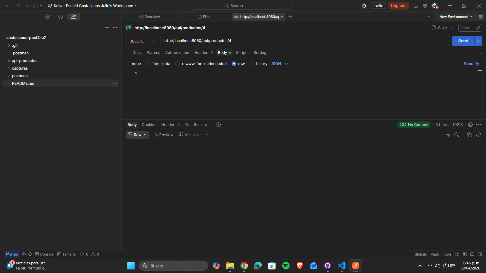
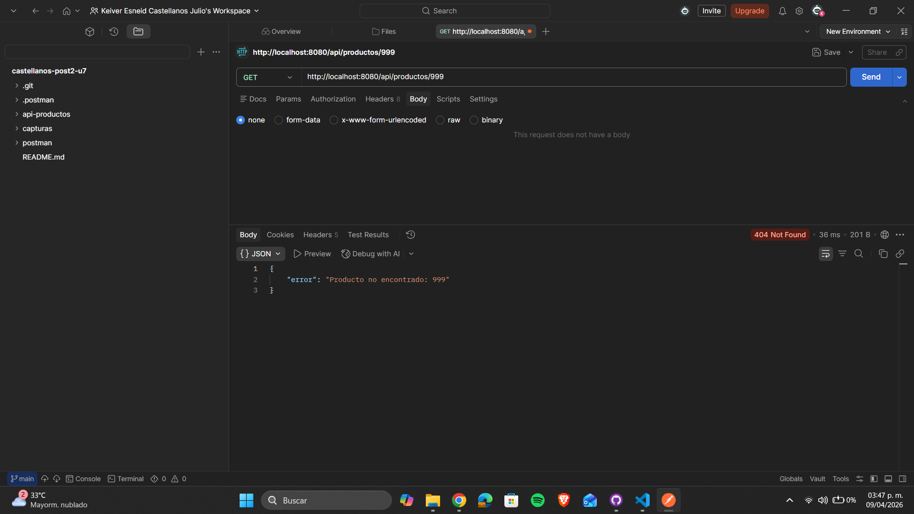

# API REST CRUD con Spring Boot — Post-Contenido 2 Unidad 7

> **Post-Contenido 2 — Unidad 7**

API REST completa desarrollada con Spring Boot que expone endpoints CRUD sobre una colección de productos en memoria. Utiliza `@RestController` y `ResponseEntity` para retornar JSON con los códigos HTTP correctos para cada operación. Incluye manejo global de excepciones con `@RestControllerAdvice`.

## Tecnologías utilizadas

- **Java 17**
- **Spring Boot 3.5.1**
- **Jackson** (incluido en Spring Web para serialización JSON)
- **Spring Boot DevTools**
- **Maven 3.9.12**

## Estructura del proyecto

```text
api-productos/
└── src/
    └── main/
        └── java/com/universidad/api_productos/
            ├── ApiProductosApplication.java
            ├── model/
            │   └── Producto.java
            ├── service/
            │   └── ProductoService.java
            └── controller/
                ├── ProductoApiController.java
                └── GlobalExceptionHandler.java
```

## Requisitos previos

- **Java 17** o superior
- **Maven 3.8+**
- **Postman** o cualquier cliente HTTP para probar los endpoints

## Instrucciones de ejecución

1. **Clonar el repositorio**

```bash
   git clone https://github.com/tu-usuario/castellanos-post2-u7.git
   cd castellanos-post2-u7/api-productos
```

2. **Ejecutar la aplicación**

```bash
   mvn spring-boot:run
```

3. **Acceder a la API**

   `http://localhost:8080/api/productos`

## Endpoints de la API

| Método | URL                 | Código éxito   | Código error    | Descripción                    |
| ------ | ------------------- | -------------- | --------------- | ------------------------------ |
| GET    | /api/productos      | 200 OK         | —               | Retorna lista completa en JSON |
| GET    | /api/productos/{id} | 200 OK         | 404 Not Found   | Retorna producto por ID        |
| POST   | /api/productos      | 201 Created    | 400 Bad Request | Crea un nuevo producto         |
| PUT    | /api/productos/{id} | 200 OK         | 404 Not Found   | Actualiza producto existente   |
| DELETE | /api/productos/{id} | 204 No Content | 404 Not Found   | Elimina producto por ID        |

## Ejemplos de uso

**Crear producto (POST):**

```json
POST /api/productos
Content-Type: application/json

{
    "nombre": "Monitor",
    "descripcion": "Monitor 27 pulgadas 4K",
    "precio": 499.99
}
```

**Actualizar producto (PUT):**

```json
PUT /api/productos/4
Content-Type: application/json

{
    "nombre": "Monitor Curvo",
    "descripcion": "Monitor curvo 32 pulgadas QHD",
    "precio": 699.99
}
```

**Respuesta de error (404):**

```json
{
  "error": "Producto no encontrado: 999"
}
```

## Funcionalidades implementadas

- **CRUD completo:** GET, POST, PUT, DELETE con códigos HTTP correctos
- **Serialización JSON:** automática con Jackson
- **Manejo global de errores:** respuestas JSON estructuradas con `@RestControllerAdvice`
- **Repositorio en memoria:** HashMap con datos de ejemplo precargados

## Capturas de pantalla (Postman)

### GET — Lista de productos (200 OK)



### POST — Crear producto (201 Created)



### PUT — Actualizar producto (200 OK)



### DELETE — Eliminar producto (204 No Content)



### GET — Producto eliminado (404 Not Found)


### GET — Error JSON estructurado (404)


